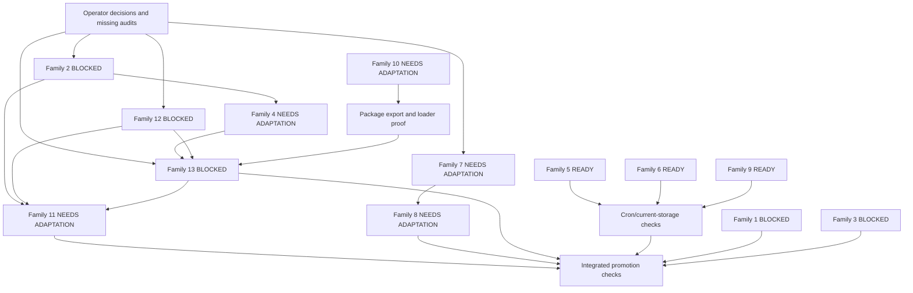

# Final cross-family compatibility synthesis for OpenClaw upstream sync

Task: `calm-peak-5381`  
Proposal: `proposal-20260809-165021-f994b3`  
Decision scope: repository, proposal, predecessor investigations, and retained Deliberation baseline only

## Scope and decision method

This report reconciles the 14 proposal families against the completed predecessor reports and the retained Deliberation contract. It does not change product code, proposal state, live configuration, external repositories, or Git state. No tests, builds, generators, or live scenarios were run for this synthesis.

The normalized statuses mean:

- `READY`: the compatibility disposition is evidence-backed and has no unresolved design dependency. Later promotion checks may still confirm that unchanged behavior remains intact.
- `NEEDS ADAPTATION`: the family has an evidence-backed disposition, but current-architecture implementation or mandatory verification work remains.
- `BLOCKED`: a required audit, dependency contract, or operator decision is missing. No implementation is prescribed for that family until the blocker is resolved.

The predecessor reports do not all inspect the same snapshot. Their conclusions are reconciled by contract and ownership, not by assuming one shared worktree state.

## Executive result

| Status             | Count | Families                                                                                                  |
| ------------------ | ----: | --------------------------------------------------------------------------------------------------------- |
| `READY`            |     4 | 5 cron trajectory suppression, 6 queued trajectory writer, 9 cron failure markers, 14 historical evidence |
| `NEEDS ADAPTATION` |     5 | 4 inbound claim, 7 channel authority, 8 reasoning effort, 10 speech-core exports, 11 generated metadata   |
| `BLOCKED`          |     5 | 1 local hygiene, 2 WhatsApp plugin-only, 3 WhatsApp login normalization, 12 SecretRef, 13 Deliberation    |

Only a dependency-closed subset is ready now. The three rejected trajectory/failure patches and the historical-evidence classification can be recorded without carrying code. Inbound claim, channel/reasoning, package/export, and generated-metadata work still need adaptation or verification. WhatsApp, SecretRef, and Deliberation prevent whole-proposal implementation.

## Revision and evidence ledger

| Family                                         | Compared revisions or retained source                                                                                                                                           | Predecessor result                                                                         | Normalized status  | Decisive reason and remaining gap                                                                                                                                                                                                                                                                                                                                                                                                                                                               |
| ---------------------------------------------- | ------------------------------------------------------------------------------------------------------------------------------------------------------------------------------- | ------------------------------------------------------------------------------------------ | ------------------ | ----------------------------------------------------------------------------------------------------------------------------------------------------------------------------------------------------------------------------------------------------------------------------------------------------------------------------------------------------------------------------------------------------------------------------------------------------------------------------------------------- |
| 1. Local repository hygiene                    | Proposal commit `c387494b4769fd0d2ec94929262a9be4fbbc5b05`; no dedicated completed report                                                                                       | No verdict                                                                                 | `BLOCKED`          | No exact generated-path or ignore-pattern evidence. It cannot inherit a runtime family's conclusion.                                                                                                                                                                                                                                                                                                                                                                                            |
| 2. WhatsApp plugin-only delivery               | Fork commits `1b491ab`, `74ccfb5`, `1516cd9`; partial source-projection evidence only in `warm-reef-8132`                                                                       | No end-to-end verdict                                                                      | `BLOCKED`          | The account/group/default precedence and claim/fallback truth table required by the proposal is absent. Generated schema evidence proves only the field's historical projection, not delivery semantics.                                                                                                                                                                                                                                                                                        |
| 3. Defensive WhatsApp login normalization      | Fork commit `1d066c8`; no dedicated completed report                                                                                                                            | No verdict                                                                                 | `BLOCKED`          | No boundary inventory or sensitive/unserializable failure matrix exists.                                                                                                                                                                                                                                                                                                                                                                                                                        |
| 4. Inbound claim contract                      | Parent `c387494`, introducing `da1059a`, final fork `03639ab`, upstream `4b85d834`; retained Deliberation source                                                                | `FORK-ONLY RETAIN`                                                                         | `NEEDS ADAPTATION` | Upstream intentionally dispatches only to a binding owner. Deliberation remains unbound. The old global block leaks dedupe state, ignores replies, and bypasses current lifecycle guarantees, so the capability must be redesigned rather than copied (`plans/investigations/warm-dune-8028_audit-inbound-claim-compatibility-across-fork-and-current-upstream.md:48-58`, `plans/investigations/warm-dune-8028_audit-inbound-claim-compatibility-across-fork-and-current-upstream.md:143-151`). |
| 5. Cron trajectory suppression                 | Fork `b0da725a`, trajectory-related `7dd48eb`, upstream `4b85d834`                                                                                                              | `Obsolete by decision`                                                                     | `READY`            | Upstream `disableTrajectory` is not cron equivalence, but repository decisions explicitly removed the incomplete cron field. The correct disposition is no port by product decision, while preserving the generic auxiliary-run flag (`plans/investigations/cool-peak-0348_audit-cron-trajectory-suppression-compatibility.md:278-305`).                                                                                                                                                        |
| 6. Queued trajectory writer                    | Fork `47c4aff1`, type follow-up `7dd48eb`, upstream `4b85d834`                                                                                                                  | Reject port/compat layer                                                                   | `READY`            | The fork writer violates current SQLite ownership and has weaker queue, close, retention, diagnostic, and error contracts. Upstream has known pre-flush memory/crash-window limitations, but those do not justify restoring the fork path (`plans/investigations/calm-peak-8671_audit-queued-trajectory-writer-compatibility-across-fork-and-upstream.md:80-86`).                                                                                                                               |
| 7. Channel runtime/model authority             | Fork sequence through final `0b4e3efe`, upstream `4b85d834`                                                                                                                     | Preserve upstream `modelByChannel`; redesign only justified model-free settings            | `NEEDS ADAPTATION` | The sole model authority is clear, but model-free channel thinking/reasoning/verbosity, ordinary-turn stale fallback repair, pre-run Gateway display, and rollback migration are unresolved (`plans/investigations/wild-dune-5465_audit-channel-runtime-and-model-authority-compatibility.md:11-30`).                                                                                                                                                                                           |
| 8. Configured reasoning effort                 | Fork `031cdbf8`, upstream `4b85d834`                                                                                                                                            | Replace                                                                                    | `NEEDS ADAPTATION` | Raw `params.reasoningEffort` is not the current control plane. Canonical thinking plus `supportedReasoningEfforts` and `reasoningEffortMap` is the replacement, but direct/managed divergence and composed `off` behavior need focused proof (`plans/investigations/calm-fork-5226_audit-configured-reasoning-effort-compatibility.md:9-15`, `plans/investigations/calm-fork-5226_audit-configured-reasoning-effort-compatibility.md:141-153`).                                                 |
| 9. Cron failure markers                        | Fork `dc43c20d`, upstream `4b85d834`                                                                                                                                            | Reject carry-forward as-is                                                                 | `READY`            | The marker changes retry/disable policy through free-form text, can override timeout classification, and is not bounded or redacted across projections. No shipped public marker contract was proven (`plans/investigations/wild-peak-2307_audit-cron-failure-marker-compatibility.md:201-220`).                                                                                                                                                                                                |
| 10. Speech-core export/runtime alias           | Fork `2c030c30`, upstream `4b85d834`                                                                                                                                            | `Obsolete by decision`                                                                     | `NEEDS ADAPTATION` | Static source and package ownership reject restoring `@openclaw/speech-core`, but package resolution, generated build/DTS gates, and clean-checkout first-reply smoke remain mandatory (`plans/investigations/quick-mist-3295_audit-speech-core-runtime-export-compatibility.md:117-150`). The remaining adaptation is verification-only unless a current route fails.                                                                                                                          |
| 11. Generated channel/config metadata          | Parent `2c030c3`, generated commit `e904c5b`, upstream `4b85d834`, retained sources                                                                                             | Do not promote old blob; source-first rebase and regenerate                                | `NEEDS ADAPTATION` | WhatsApp source semantics must be rebased before generation. Deliberation is plugin config, not a channel, and must remain absent from channel metadata. Exact generated bytes depend on blocked source-family decisions (`plans/investigations/warm-reef-8132_audit-generated-channel-and-config-metadata-compatibility.md:11-16`, `plans/investigations/warm-reef-8132_audit-generated-channel-and-config-metadata-compatibility.md:114-148`).                                                |
| 12. SecretRef credential surfaces              | Retained manifest, registry, docs, runtime resolver; no complete family report                                                                                                  | Partial evidence only                                                                      | `BLOCKED`          | The Deliberation path is declared in manifest metadata, the generated registry/docs list it, runtime collection materializes it, and the KM client resolves it. Parsing, generated matrix, doctor migration/diagnostics, redaction, source-checkout, and raw-secret non-persistence have not been audited together.                                                                                                                                                                             |
| 13. Deliberation extension                     | Capability snapshot `0b4e3efe`, residue snapshot `0b4e3efe` plus then-current worktree, inbound comparison through `03639ab`/`4b85d834`, retained current docs/contracts/source | Literal strict contract unsupported; bounded plugin possible with decisions; no v1 residue | `BLOCKED`          | It depends on Families 4 and 12, strict fail-closed scope is undecided, and current retained outbound behavior is intentionally inactive. The older service/sender snapshot cannot override the retained contract. History/source identity and external KM behavior still need integrated proof.                                                                                                                                                                                                |
| 14. Historical plans and architecture evidence | Residue audit snapshot `0b4e3efe` plus repository artifacts                                                                                                                     | Clean of executable v1 residue; historical matches classified as archival                  | `READY`            | Durable current docs/contracts and final investigations remain evidence. Retired v1 names and implementation plans are historical/audit material, not runtime or product authority (`plans/investigations/swift-mist-4312_audit-deliberation-v1-residue-in-openclaw-fork.md:180-219`).                                                                                                                                                                                                          |

## Retained Deliberation baseline

The retained contract is narrower than some predecessor aspirations:

- Configured Discord sources are silent in ordinary dispatch and eligible inbound requests are submitted synchronously to KM (`docs/plugins/reference/deliberation.md:8-10`, `extensions/deliberation/src/intake.ts:58-113`).
- Admission requires host-authored `provider=discord`, `eventType=message`, `eventKind=user_request`, agreeing account/channel/message/sender identities, and exclusion of the processing route (`extensions/deliberation/src/route-match.ts:64-108`).
- The canonical source identity is the full `v1:<provider>:<account>:<channel>` tuple. Historical account-less identities are audit-only and cannot participate in current operations (`extensions/deliberation/contracts/source-identity-v1.json:2-19`).
- History v1 reads exactly 20 messages before a cutoff. History v2 captures an exclusive cutoff through an inclusive watermark with 50-message and 32 KiB bounds and fails closed on provider errors (`extensions/deliberation/contracts/history-read-v1.json:1-34`, `extensions/deliberation/contracts/history-read-v2.json:1-8`, `extensions/deliberation/src/history-read.ts:21-219`).
- Structured SecretRefs are the operator-facing credential contract. Runtime may receive a materialized string after the secrets layer resolves the structured input; this does not authorize plaintext source config (`docs/plugins/reference/deliberation.md:23-57`, `extensions/deliberation/src/config.ts:22-24`, `extensions/deliberation/src/km-client.ts:538-563`).
- KM owns the closed six-operation protocol and four controls. External KM implementation remains unverified by this repository-only synthesis (`docs/plugins/reference/deliberation.md:59-72`, `extensions/deliberation/contracts/km-wire-v1.json:295-310`).
- Outbound delivery is intentionally inactive until KM carries an immutable authorized destination. The current plugin registers no service, and its plugin test expects no service registration (`docs/plugins/reference/deliberation.md:99-107`, `extensions/deliberation/index.ts:12-78`, `extensions/deliberation/src/plugin.test.ts:1-44`).

The exported `createFinalDeliveryAdapter` does not change the last point. It has no production caller, is documented as non-durable, and derives a Discord destination from `deliveryEnvelope.sourceTarget` (`extensions/deliberation/src/final-adapter.ts:37-56`, `extensions/deliberation/index.ts:8`). That source identity is not proof of an authorized outbound destination. It must remain inactive under the retained contract.

## Contradiction register

| Contradiction                                                                                                         | Reconciliation                                                                                                                                                                                                  | Consequence                                                                                                                                                            |
| --------------------------------------------------------------------------------------------------------------------- | --------------------------------------------------------------------------------------------------------------------------------------------------------------------------------------------------------------- | ---------------------------------------------------------------------------------------------------------------------------------------------------------------------- |
| Reports compare different worktree revisions                                                                          | Treat each report as evidence for its named commits and compare invariant ownership, not file equality. The current retained docs/contracts decide current Deliberation activation.                             | No report may silently upgrade another report's snapshot.                                                                                                              |
| Final fork had global claims; upstream documents targeted-only claims                                                 | Both are true. The runner still exists upstream, but production dispatch intentionally reaches only the binding owner.                                                                                          | Family 4 is retained capability with current-lifecycle adaptation, not upstream equivalence.                                                                           |
| The capability report recommends non-claiming intake; retained intake returns `handled: true`                         | The non-claiming design was a workaround for the old global handled-path dedupe/reply defect. A correctly adapted current lifecycle may safely honor a successful claim.                                        | Do not preserve the workaround and the fixed claim path simultaneously. Choose one canonical completion path after Family 4 is designed.                               |
| Deliberation docs say fail closed; decision hooks fail open on error/timeout and cannot run when the plugin is absent | Current `before_dispatch` is a synchronous local route check, so KM failure is covered while the plugin is loaded. Host timeout, thrown hook, load failure, and absent plugin are not covered by that contract. | Operator must define whether fail closed means KM failure only or includes plugin availability. Strict availability requires a generic readiness/routing prerequisite. |
| Residue audit observed one service and durable sender; retained docs say sender inactive                              | The residue audit describes its earlier snapshot. Current `index.ts` registers no service, and current docs explicitly prohibit destination inference.                                                          | No sender activation is part of this sync. Sole-send aspirations remain a future contract decision.                                                                    |
| Deliberation docs require structured SecretRefs; parser and manifest accept strings                                   | Source config and materialized runtime config are different layers. Runtime string acceptance is necessary after secret resolution and does not prove plaintext source acceptance is safe.                      | A complete Family 12 audit must prove the source/runtime boundary, doctor behavior, and non-persistence rather than narrowing either layer by assumption.              |
| `modelByChannel` is canonical, but final fork also retained model-free channel profiles                               | There is one model authority, but upstream does not contain the supplemental thinking/reasoning/verbosity surface.                                                                                              | Operator must retain, redesign, or explicitly drop those settings before reasoning transport work is finalized. Never restore `runtimeByChannel[*][*].model`.          |
| Cron suppression was removed, but upstream has `disableTrajectory`                                                    | The lower-level flag is real but cron never sources it. The no-port decision rests on explicit removal of an incomplete/unused cron feature, not on equivalence.                                                | Preserve generic auxiliary-run behavior and do not add a cron field or migration.                                                                                      |
| Old speech alias is obsolete, but promotion proof is incomplete                                                       | Source ownership proves the old package boundary should not return. It does not prove every source/dist/package path boots.                                                                                     | Verify current exports and loader first; do not add an alias preemptively.                                                                                             |
| Old generated WhatsApp blob contains retained fields; target-base blob does not                                       | Generated blobs are revision projections. The old field proves intended semantics only; source schema is authority.                                                                                             | Rebase source, then regenerate on the target base. Never transplant `e904c5b` output.                                                                                  |

## Cross-family interaction findings

### WhatsApp plugin-only, inbound claim, fallback, and sole-send

Owner chain:

```text
WhatsApp account/group/default policy
  -> channel admission and source delivery policy
  -> binding-owner claim eligibility
  -> global claim eligibility and ordering
  -> claimed reply/silence or unclaimed OpenClaw fallback
  -> outbound authority, if any
```

Proved facts:

- The final fork ran a global claimant after the binding-owner path and before ordinary observation/commands. A source-delivery deny could skip the targeted owner while the global phase still ran (`plans/investigations/warm-dune-8028_audit-inbound-claim-compatibility-across-fork-and-current-upstream.md:42-46`, `plans/investigations/warm-dune-8028_audit-inbound-claim-compatibility-across-fork-and-current-upstream.md:124-126`).
- The retained WhatsApp source schema historically exposed `deliveryPolicy` at root-group and account-group scopes and defaulted omission to `auto-reply`, but the target base does not contain the field (`plans/investigations/warm-reef-8132_audit-generated-channel-and-config-metadata-compatibility.md:59-76`).

Unproved facts:

- Precedence across account, group, and default policy.
- Whether `plugin-only` permits binding-owner claims, global claims, both, or neither.
- Whether unclaimed, throwing, timed-out, missing, or unavailable claimants stay silent or fall back.
- Whether a claim reply is deliverable under plugin-only policy and which owner is allowed to send it.

Finding: Family 4 must not be released onto WhatsApp until Family 2 supplies the proposal truth table. Deliberation's Discord-only source policy does not answer WhatsApp's generic claim/fallback contract. WhatsApp plugin-only and Deliberation sole-send are separate authority questions.

### Deliberation, Discord dispatch, history, and source identity

Owner chain:

```text
Discord monitor policy and self-message filtering
  -> host-authored provider/event/account/channel/message/sender facts
  -> current dispatch lifecycle and dedupe ownership
  -> Deliberation global claim and KM intake
  -> terminal source silence
  -> sourceTarget-bound history v1/v2 reads
```

Proved facts:

- Current upstream's claim payload removes the top-level provider/event-kind facts Deliberation requires, while adding richer media and owner facts (`plans/investigations/warm-dune-8028_audit-inbound-claim-compatibility-across-fork-and-current-upstream.md:86-97`).
- Deliberation rejects disagreement between event and context facts, missing provider event/sender ids, processing-route traffic, and malformed source identities (`extensions/deliberation/src/route-match.ts:69-108`).
- History reads bind the same full source identity to one configured account/channel and fail the Gateway method closed on read errors (`extensions/deliberation/index.ts:42-55`, `extensions/deliberation/src/history-read.ts:81-219`).

Finding: host-authored event classification must be prepared before plugin dispatch and reused by claims and later history/correlation proof. Deliberation must not infer `user_request`, provider, account, or destination from display text. A global claim added without these facts would still reject every retained Deliberation event. A Deliberation port added without the global lifecycle would register successfully but never intake, while `before_dispatch` could still suppress matching traffic.

### SecretRef, schema generation, and doctor

Owner chain:

```text
Deliberation manifest configContracts.secretInputs
  -> plugin metadata snapshot
  -> target registry and generated credential matrix/docs
  -> runtime assignment collection and SecretRef materialization
  -> plugin parser and KM request resolution
  -> doctor migration/diagnostics and redaction proof
```

Partial proof:

- The manifest declares `km.credential` as a string-resolving secret input (`extensions/deliberation/openclaw.plugin.json:71-77`).
- Plugin metadata generates configure/apply/audit registry entries (`src/secrets/target-registry-data.ts:17-34`, `src/secrets/target-registry-data.ts:68-85`).
- Runtime collection resolves manifest-declared plugin paths only when active, preserving inactive-plugin diagnostics (`src/secrets/runtime-config-collectors-plugins.ts:23-34`, `src/secrets/runtime-config-collectors-plugins.ts:87-129`).
- The canonical docs and generated matrix list the exact Deliberation path (`docs/reference/secretref-credential-surface.md:44-49`, `docs/reference/secretref-user-supplied-credentials-matrix.json:558-560`).

Missing proof:

- Complete source-config parse, configure, apply, audit, reload, and source-checkout behavior.
- Invalid/missing provider/id diagnostics and legacy marker migration through doctor.
- Raw credential non-serialization across config snapshots, logs, KM errors, generated docs, and plugin diagnostics.
- Idempotent regeneration and matrix/doc consistency on the target base.

Finding: Family 12 remains blocked. Existing partial alignment is enough to define the audit path, not enough to approve SecretRef promotion or Deliberation configuration.

### Channel authority and reasoning effort

Owner chain:

```text
explicit turn selection
  -> explicit or locked session override
  -> channels.modelByChannel primary
  -> model/default canonical thinking
  -> model supported effort set and compatibility map
  -> provider transport/wrapper payload
  -> session/status projection
```

Proved facts:

- Upstream `modelByChannel` is the sole persistent model authority. Explicit turn and session selections stay ahead of it (`plans/investigations/wild-dune-5465_audit-channel-runtime-and-model-authority-compatibility.md:42-56`).
- Raw `params.reasoningEffort` survives open config merging but is inert in the normal bundled embedded payload path and can still alter OpenAI routing (`plans/investigations/calm-fork-5226_audit-configured-reasoning-effort-compatibility.md:62-73`, `plans/investigations/calm-fork-5226_audit-configured-reasoning-effort-compatibility.md:143-149`).
- Canonical thinking intent is visible in status/session/UI, while translated wire effort generally is not (`plans/investigations/calm-fork-5226_audit-configured-reasoning-effort-compatibility.md:115-128`).

Finding: settle channel authority and migration first. Then adapt reasoning at the canonical thinking/compatibility boundary. If model-free per-channel reasoning survives, its precedence must be explicit between channel model selection and session/request thinking; it cannot be smuggled back through a model-bearing `runtimeByChannel` or opaque raw provider params.

### Cron trajectory, writer lifecycle, and failure reporting

Owner chain after reconciliation:

```text
cron path classification
  -> agent turn uses current SQLite trajectory recorder, command does not
  -> current attempt cleanup/flush
  -> independent command process outcome and delivery/state projections
```

Finding:

- Do not port the cron payload opt-out. Its removal is explicit; generic `disableTrajectory` remains unrelated auxiliary-run behavior.
- Do not port the batched writer. Current SQLite remains the trajectory owner, including its known pre-flush memory/crash-loss limitations.
- Do not port `CRON_FAILURE:`. Command status, summary, diagnostics, retry classification, delivery, and state remain current upstream responsibilities.
- Do not create a combined trajectory/failure abstraction. Command jobs do not enter the embedded recorder path, and failure text policy is independent of trajectory storage.

These three dispositions are mutually compatible and dependency-closed (`plans/investigations/cool-peak-0348_audit-cron-trajectory-suppression-compatibility.md:290-305`, `plans/investigations/calm-peak-8671_audit-queued-trajectory-writer-compatibility-across-fork-and-upstream.md:80-86`, `plans/investigations/wild-peak-2307_audit-cron-failure-marker-compatibility.md:201-220`).

### Package exports, plugin build, and loader

Owner chain:

```text
current plugin SDK source entrypoints
  -> package export and build entry generation
  -> source/dist alias resolution
  -> bundled plugin metadata copy and loader activation
  -> clean-checkout Gateway boot and first lazy reply
```

Finding: the old `@openclaw/speech-core` package and alias stay retired. Current speech plugins use `openclaw/plugin-sdk/speech-core` and `openclaw/plugin-sdk/tts-runtime`; core uses relative `src/tts/**` imports. Verify those current routes before plugin-wide build/loader proof. If a check fails, diagnose the current owner chain rather than restoring the retired alias by default (`plans/investigations/quick-mist-3295_audit-speech-core-runtime-export-compatibility.md:44-106`, `plans/investigations/quick-mist-3295_audit-speech-core-runtime-export-compatibility.md:130-142`).

Generated metadata follows source and loader decisions. WhatsApp must be merged into its current source schema first. Deliberation must remain absent from channel metadata because it declares no channel; its manifest/config and built metadata copy are checked through plugin paths instead (`plans/investigations/warm-reef-8132_audit-generated-channel-and-config-metadata-compatibility.md:32-39`).

## Dependency graph



Blocked nodes are intentional. The graph does not authorize work around them.

## Exact implementation and check order

| Checkpoint                               | Included families                         | Required prior decision                                                                                      | Intended result                                                                                                                                                                                                                 | Focused proof                                                                                                                                                                                                                                  | Stop condition                                                                                                                        |
| ---------------------------------------- | ----------------------------------------- | ------------------------------------------------------------------------------------------------------------ | ------------------------------------------------------------------------------------------------------------------------------------------------------------------------------------------------------------------------------- | ---------------------------------------------------------------------------------------------------------------------------------------------------------------------------------------------------------------------------------------------- | ------------------------------------------------------------------------------------------------------------------------------------- |
| 0. Close evidence and operator gates     | 1, 2, 3, 12, 13; operator part of 4 and 7 | None                                                                                                         | Produce the missing audits and explicit decisions: WhatsApp truth table, login error boundary, SecretRef lifecycle, strict fail-closed scope, outbound inactivity, global-claim precedence, and model-free profile disposition. | Proposal-required matrices and repository-only contract evidence; live proof remains later.                                                                                                                                                    | Stop all dependent implementation while any family remains `BLOCKED`. Do not prescribe or write blocked-family code.                  |
| 1. Record independent no-port decisions  | 5, 6, 9, 14                               | Approval of the synthesis dispositions                                                                       | Preserve current generic `disableTrajectory`, SQLite trajectory storage, current cron failure semantics, and durable evidence classification. Carry none of the rejected fork patches.                                          | Source/reference searches and unchanged current focused tests during later promotion.                                                                                                                                                          | Stop if a shipped public contract or persisted active state contradicts the predecessor evidence.                                     |
| 2. Prove current package/export baseline | 10                                        | Old private package remains unsupported                                                                      | Resolve current speech SDK source and packed exports, build JS/DTS, and boot a clean checkout through the first lazy reply without `@openclaw/speech-core`.                                                                     | Package-resolution test, export/DTS/release gates, generated artifact search, clean-checkout plugin boot/reply smoke.                                                                                                                          | Stop on any old generated import or current path failure. Diagnose current ownership; do not auto-add the retired alias.              |
| 3. Establish canonical channel authority | 7                                         | Operator disposition for model-free channel settings                                                         | Keep `modelByChannel` as sole model authority; handle stale automatic fallback, display, and rollback migration without a model-bearing supplement.                                                                             | Existing/fresh session, explicit turn/session override, channel change, stale state, unavailable model, status, Gateway row, doctor, migration dry run and rollback.                                                                           | Stop if rollback configuration cannot be mapped without losing an operator-approved field.                                            |
| 4. Adapt reasoning transport             | 8                                         | Checkpoint 3 complete                                                                                        | Use canonical thinking and compatibility metadata, preserving request/session precedence and provider support behavior.                                                                                                         | Exact high/xhigh, unsupported omission, model/session/request precedence, composed `off`, direct versus managed routes, status/session intent, final wire payload.                                                                             | Stop if one transport path retains raw `params.reasoningEffort` authority or re-enables thinking for canonical `off`.                 |
| 5. Adapt generic inbound lifecycle       | 4                                         | Family 2 audit complete; operator chooses binding/global/fast-command precedence and fail-open/closed policy | Add one current-lifecycle global claim phase with host-authored event facts, deterministic arbitration, abort/timeout handling, optional reply delivery, observation policy, dedupe settlement, and operation finalization.     | Global reply, duplicate replay, claimant ordering/error/timeout, source abort, media-only intake, commands, source policy, binding-owner exclusivity, observations, and lifecycle completion. Include every distinct Family 2 truth-table row. | Stop if WhatsApp policy or binding ownership cannot be preserved without semantic loss.                                               |
| 6. Reclassify SecretRef and Deliberation | 12, 13                                    | Checkpoints 0, 2, and 5 complete                                                                             | Run the completed audits again against the intended target tree and assign new statuses. Retain inactive outbound behavior unless an independently approved immutable KM destination contract exists.                           | SecretRef configure/apply/audit/doctor/redaction/source-checkout proof; Deliberation registration, intake, fail-closed boundaries, source identity, history v1/v2, KM fixtures, no v1 residue, and no active sender.                           | While either family remains `BLOCKED`, stop. This checkpoint authorizes no Deliberation or SecretRef code by itself.                  |
| 7. Regenerate target-base projections    | 11                                        | Source families 2, 12, and 13 have approved target-base source state                                         | Generate WhatsApp channel metadata from target sources; keep Deliberation out of channel metadata; regenerate config docs and built plugin metadata.                                                                            | `config:channels:gen`, `config:docs:gen`, immediate checks, idempotent second generation, semantic diff, focused config/metadata tests, build, generated release check.                                                                        | Stop on unexpected channel entries, missing WhatsApp paths, raw secrets, non-idempotence, or manifest/runtime schema drift.           |
| 8. Integrated promotion gate             | All non-excluded families                 | Every actionable family has an explicit final status; all exclusions approved                                | Validate the complete target branch without touching live configuration.                                                                                                                                                        | Focused suites above, full build/DTS/export checks, copied/sanitized config doctor, clean-checkout plugin boot, generated consistency, rollback rehearsal, and integrated Discord/WhatsApp scenarios when authorized.                          | No promotion while any non-excluded family is blocked, any generated artifact drifts, or any required real behavior proof is missing. |

## Proposal section updates

These are recommendations only. The proposal file and database remain unchanged.

### Goal and evidence baseline

- Add an evidence ledger with each report's pinned fork/upstream revision instead of implying one common inspected tree.
- State that the current retained Deliberation docs/contracts are authoritative for activation, especially inactive outbound delivery.
- Separate decision evidence from later executable promotion proof.

### Family 1

- Replace the open question with `Blocked/unknown` pending exact ignore evidence.

### Family 2

- Mark `Blocked/unknown` pending the complete policy-source by claim-outcome by fallback truth table.
- Add global versus binding-owner claim precedence and reply authority to the gate.
- Keep generated metadata work downstream of the source-level decision.

### Family 3

- Mark `Blocked/unknown` pending the specified malformed/sensitive result matrix and current generic normalizer mapping.

### Family 4

- Keep `Fork-only, retain`, but rename the work to a current-lifecycle global claim capability rather than restoration of `da1059a`.
- Add host-authored provider/event type/event kind, lifecycle admission, abort/timeout, reply, dedupe, observation, command, and source-policy requirements.
- Add Family 2 as a release dependency and Family 13 as the retained consumer proof.

### Family 5

- Set `Obsolete by decision`.
- Correct the rationale: upstream `disableTrajectory` is not cron coverage; the fork cron feature was explicitly removed as incomplete and unused.

### Family 6

- Reject both the batched writer and the type-only follow-up as compatibility layers.
- Record current SQLite ownership and its residual pre-flush memory/crash-window risk as a separate non-port concern.

### Family 7

- Record `modelByChannel` as the sole model authority.
- Split model-free channel settings, stale origin fallback repair, display, and migration into explicit adaptation items.
- Prohibit restoring `runtimeByChannel[*][*].model`.

### Family 8

- Replace raw `params.reasoningEffort` with canonical thinking plus supported-effort and mapping metadata.
- Add composed disabled behavior and direct/managed route parity to the gate.
- Make Family 7's precedence decision a prerequisite.

### Family 9

- Reject the free-form marker as-is and preserve current timeout/signal/exit ownership.
- If explicit command failure classification is desired later, require a separate typed proposal with closed retry and projection contracts.

### Family 10

- Set the old alias to `Obsolete by decision` but leave the family open for verification.
- Name the current speech SDK paths and require package/export/DTS plus clean-checkout first-reply proof before closure.

### Family 11

- Prohibit promotion of `e904c5b` bytes.
- Require source-first WhatsApp rebase, target-base generation, semantic review, and idempotence.
- State explicitly that Deliberation has plugin config but no channel metadata entry.

### Family 12

- Mark `Blocked/unknown` despite partial current alignment.
- Add one end-to-end ledger covering manifest declaration, registry/matrix/docs generation, runtime resolution, plugin parsing, doctor migration/diagnostics, redaction, and raw-secret non-persistence.

### Family 13

- Mark blocked pending Families 4 and 12 plus operator decisions.
- Preserve the full source identity and history v1/v2 contracts.
- Narrow fail-closed wording to its proved availability domain unless a generic required-plugin/readiness gate is approved.
- State that outbound delivery is inactive. Do not activate the exported adapter or infer destination from source identity.
- Preserve the no-v1/no-dual-authority residue requirement.

### Family 14

- Preserve the proposal, final investigations, retained operator docs, accepted contracts, and provenance records as durable evidence.
- Classify retired v1 implementation plans, checkpoints, and obsolete architecture attempts as historical/audit evidence only, with no runtime or release authority.
- Do not use `CHANGELOG.agent.md` as a release contract.

### Cross-family review

- Replace the flat interaction list with the dependency graph and ordered checkpoints in this report.
- Add explicit stop conditions for blocked families and prohibit generated-artifact work before source decisions.

### Promotion gate

- Require final status for all 14 families and explicit operator exclusion for every remaining blocked family.
- Add current package export/clean-checkout proof before plugin loader proof.
- Add target-base generated idempotence after source changes.
- Add copied/sanitized-config doctor and migration preview after SecretRef/channel decisions.
- Preserve the existing prohibition on live config, Gateway restart, push, or promotion before review approval.

## Unresolved operator decisions

1. Whether global unbound claims run before or after fast abort/approval and recognized commands, while retaining binding-owner exclusivity.
2. The exact WhatsApp plugin-only policy precedence and behavior for handled, unhandled, error, timeout, missing-plugin, and denied-delivery rows.
3. Whether Deliberation fail closed covers only KM failure while the plugin is loaded, or also plugin load/registration failure and host hook timeout.
4. Whether model-free per-channel `thinkingLevel`, `reasoningLevel`, and `textVerbosity` remain product requirements, and their precedence if retained.
5. Whether outbound Deliberation remains inactive for this sync. Any activation requires an immutable KM-authorized destination and separate provider reconciliation decision; current source identity is insufficient.
6. Whether an at-most-one reserved send attempt with possible unknown/non-delivery is acceptable for any future pilot, and who owns Discord reconciliation.
7. Which blocked families may be consciously excluded from the integration scope after their impact is understood.

## Evidence limits

- No tests, builds, generators, product-code lints, live config, live Discord/WhatsApp, external KM, external provider, or external repository checks were run as investigation evidence. Markdown format and lint checks validate only this report.
- Predecessor reports pin different revisions; current file presence cannot retroactively change their historical findings.
- Family 2, Family 3, and the complete Family 12 lifecycle lack dedicated completed audits. Family 1 lacks its exact ignore audit.
- Static repository evidence cannot prove external KM history, reservation, provider delivery, or reconciliation behavior.
- Existing tests cited by predecessor reports are evidence of intended contracts unless those reports explicitly recorded execution. This synthesis did not rerun them.
- The report path helper is absent, so the deterministic fallback path under `plans/investigations/` is used.

PARTIALLY SAFE
